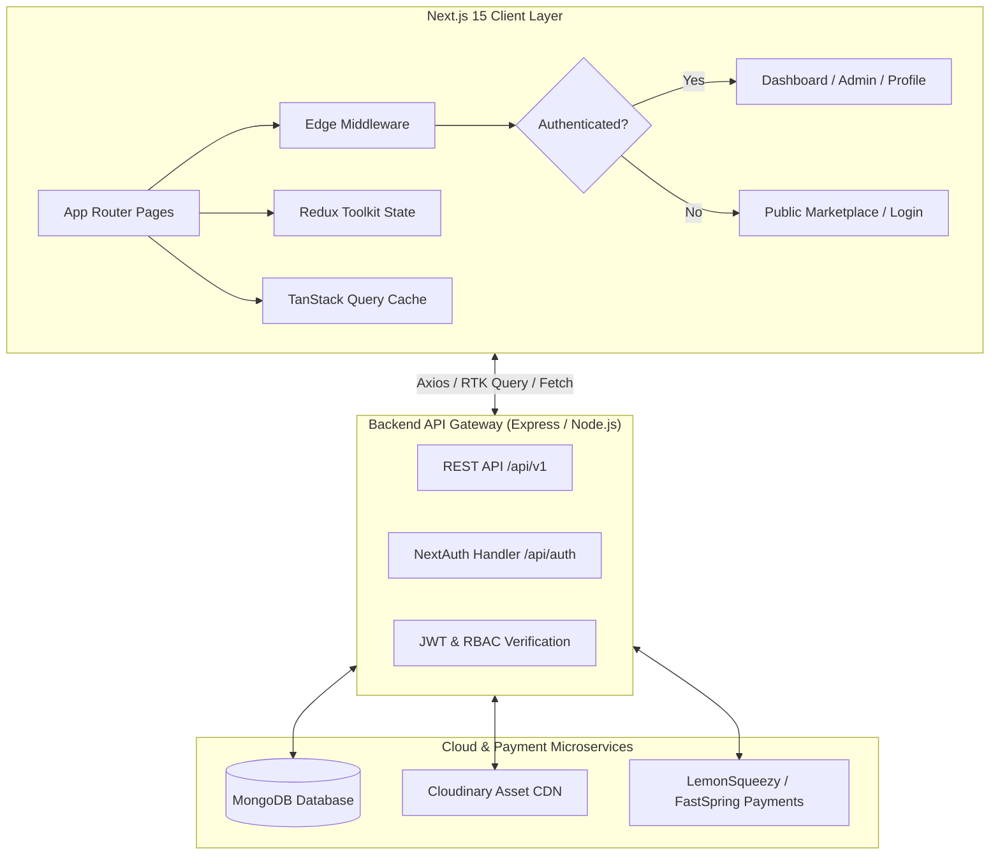

# ⚡ Themora — Enterprise-Grade Template Marketplace & Developer Hub

<div align="center">


[](https://nextjs.org/)
[](https://react.dev/)
[](https://www.typescriptlang.org/)
[](https://tailwindcss.com/)
[](https://redux-toolkit.js.org/)
[](https://tanstack.com/query/latest)

<br/>

[](https://themora.vercel.app)
[](https://themora-backend.vercel.app)
[](LICENSE)

<p align="center">
  <b>A high-performance digital marketplace for modern web developers, SaaS founders, and UI/UX designers. Built with Next.js 15 App Router, React 19, Redux Toolkit, TanStack Query, TipTap WYSIWYG, and multi-provider payment pipelines.</b>
</p>

[Explore Live Demo](https://themora.vercel.app) • [View API Docs](https://themora-backend.vercel.app/api/v1) • [Report Issue](https://github.com/yourusername/themora/issues)

</div>

---

## 🌟 Executive Summary

**Themora** is an end-to-end e-commerce platform and content ecosystem built for selling, previewing, and managing digital assets (Next.js boilerplates, Tailwind landing pages, and dashboard templates). 

Engineered with an emphasis on **type safety, sub-second latency, robust Role-Based Access Control (RBAC)**, and **frictionless checkout experiences**, Themora bridges the gap between sleek aesthetic design and scalable software engineering.

---

## 🔑 Interactive Demo Credentials

For quick evaluation during portfolio & resume reviews, the application includes a **1-click instant demo login** system on the `/login` page:

| Role | Email | Password | Access Capabilities |
| :--- | :--- | :--- | :--- |
| **🛡️ Platform Administrator** | `admin@themora.test` | `Admin@Themora2026!` | Full Admin Panel, Template CRUD, Category Manager, Analytics, Blog Editor |
| **👤 Verified Customer** | `sarah.user@themora.test` | `User@Themora2026!` | Customer Dashboard, Order History, Invoice & Receipt Generator, Profile Management |

---

## 🚀 Key Engineering Highlights

### 1. **Next.js 15 App Router & Server/Client Hybrid Architecture**
- Leverages Server Components for fast SEO-indexed metadata generation (`/template/[id]`) and static ISR caches.
- Client components encapsulate interactive UI boundaries (search filters, responsive category horizontal scroll tabs, interactive preview dialogs).

### 2. **Dual-Layered State Management**
- **Client UI State**: Managed cleanly via **Redux Toolkit (`@reduxjs/toolkit`)** with typed slices for authentication, UI drawers, notifications, and shopping carts.
- **Server Cache & Synchronization**: Powered by **TanStack Query (React Query v5)** and **RTK Query** with automatic cache invalidation on template/category mutations.

### 3. **Edge Route Protection & RBAC Middleware**
- Custom Next.js Edge Middleware (`middleware.ts`) enforcing zero-latency route authorization.
- Authenticated users attempting to visit `/login`, `/register`, or `/forget` are seamlessly redirected to their respective role dashboard with flash alerts.

### 4. **Dynamic Taxonomy & Real-Time Sync**
- Smart category filtering tab bar that dynamically calculates active template inventory counts in real time, automatically hiding zero-count orphan categories while retaining scrollable UX across mobile and desktop.

### 5. **Rich Text Publishing Engine (TipTap)**
- Custom TipTap WYSIWYG editor with live markdown parsing, code blocks, typography formatting, and direct backend multipart Cloudinary asset streaming.

### 6. **Multi-Gateway Payment Flow & Purchase Verification**
- Integrated checkout workflow architected for **LemonSqueezy** & **FastSpring** webhook callbacks, featuring printable transactional receipt modals, transaction hash verification, and license key generation.

---

## 🛠️ Technology Stack

```
Frontend Architecture
├── Core Framework       : Next.js 15.5.11 (React 19, TypeScript 5)
├── Styling Engine       : Tailwind CSS v4 + tw-animate-css + Radix UI Primitives
├── Global State         : Redux Toolkit (RTK) + React-Redux
├── Server Sync / Cache  : TanStack React Query v5 + RTK Query
├── Authentication       : NextAuth.js v4 + JWT + Google OAuth + JOSE / HKDF
├── Form Validation      : React Hook Form + Zod Schema Validation
├── Rich Text Editor     : TipTap Editor Core + Image/Link Extensions
├── UI / Visuals         : Lucide React, Framer Motion, Swiper 11, React-CountUp
├── Charts & Analytics   : Chart.js + React-Chartjs-2
└── Notifications        : Sonner + SweetAlert2
```

---

## 📐 System Architecture



---

## 💻 Feature Breakdown

### 🛍️ Marketplace & Customer Experience
- **Live Search & Taxonomy Filter**: Instant filtering by category, price ranges, ratings, and technology stacks with smooth horizontal scroll navigation.
- **Dynamic Template Detail Pages**: High-fidelity live previews, feature grids, customer reviews, tech stack chips, and responsive changelog tabs.
- **Customer Billing & Receipt Hub**: Full customer-facing payment ledger featuring transaction date, payment gateway branding, license keys, and 1-click printable PDF receipts.
- **Profile & Avatar Uploader**: Direct multipart profile photo updates synced across Redux and server sessions.

### 🛡️ Admin & Operational Hub
- **Analytics & Revenue Overview**: Interactive revenue growth charts and live inventory metrics.
- **Template Lifecycle Management**: Comprehensive create/edit/delete workflows with multi-screenshot upload, pricing configuration, and live preview URL embedding.
- **Category Taxonomy Manager**: Real-time category creation with auto-updating item counters.
- **CMS Blog Studio**: WYSIWYG blog creation engine equipped with image uploaders and SEO metadata fields.

### 🎨 Design & Accessibility
- **Modern Glassmorphic Theme**: Sleek dark/light theme switching via `next-themes`.
- **Fluid Micro-Animations**: Smooth Framer Motion transitions and marquee carousels for social proof.
- **Responsive-First UI**: 100% responsive across mobile, tablet, laptop, and ultra-wide viewports.

---

## 📂 Project Directory Structure

```
Themora_Frontend/
├── app/                                # Next.js 15 App Router
│   ├── (WithCommonLayout)/             # Public route group (Navbar & Footer)
│   │   ├── (home)/                     # Landing page with hero & featured items
│   │   ├── blogs/                      # Blog articles & detailed views
│   │   ├── template/                   # Template catalog & dynamic [id] view
│   │   ├── services/                   # Custom development services
│   │   ├── contact/                    # Contact & inquiry form
│   │   └── about-us/                   # Company information & mission
│   ├── dashboard/                      # RBAC Protected Admin & Customer Dashboard
│   │   ├── (admin)/                    # Template CRUD, Categories, Blog Editor
│   │   ├── payment/                    # User payment history & invoice modal
│   │   └── profile/                    # User settings & security
│   ├── api/auth/[...nextauth]/         # NextAuth authentication provider routes
│   ├── login/ & register/ & forget/    # Guest-only authentication routes
│   └── layout.tsx                      # Root layout with Theme & Redux providers
├── components/
│   ├── modules/
│   │   ├── CommonModules/              # Public reusable modules (Auth, Template, Home)
│   │   └── DadhboardModules/           # Dashboard data tables, forms & TipTap editor
│   ├── shared/                         # Shared Navbar, Footer, PageHeaders
│   └── ui/                             # Radix UI atoms (Dialog, Button, Input, Dropdown)
├── hooks/                              # Custom React hooks (useAuth, useTemplates, etc.)
├── lib/                                # Config, Axios client, utility helpers
├── redux/                              # Redux Toolkit store, auth slice, RTK APIs
├── types/                              # Strict TypeScript interfaces & API response types
└── middleware.ts                       # Edge authentication & redirect middleware
```

---

## ⚡ Getting Started

### Prerequisites
- **Node.js**: `v18.18.0` or higher (Node 20+ recommended)
- **Package Manager**: `npm` (v9+) or `yarn` / `pnpm`
- **Git**

### Installation

1. **Clone the repository:**
   ```bash
   git clone https://github.com/yourusername/themora-frontend.git
   cd themora-frontend
   ```

2. **Install dependencies:**
   ```bash
   npm install
   ```

3. **Configure environment variables:**
   Create a `.env.local` file in the root directory:
   ```env
   # Backend API Endpoint
   NEXT_PUBLIC_API_URL=https://themora-backend.vercel.app/api/v1

   # NextAuth Configuration
   NEXTAUTH_URL=http://localhost:3000
   AUTH_SECRET=your_super_secret_auth_token_here

   # Google OAuth (Optional)
   GOOGLE_CLIENT_ID=your_google_client_id
   GOOGLE_CLIENT_SECRET=your_google_client_secret
   ```

4. **Launch the development server:**
   ```bash
   npm run dev
   ```
   Open [http://localhost:3000](http://localhost:3000) in your browser.

5. **Type Check & Build for Production:**
   ```bash
   # Type check with TypeScript compiler
   npx tsc --noEmit

   # Build optimized production bundle
   npm run build

   # Start production server
   npm run start
   ```

---

## 📊 Core Performance Metrics

| Metric | Target / Score | Details |
| :--- | :--- | :--- |
| **⚡ Performance (Lighthouse)** | **95+** | Optimized WebP images, automatic code-splitting & font preloading |
| **♿ Accessibility (WCAG 2.1 AA)** | **100** | Full keyboard navigation, ARIA labels, semantic markup |
| **🛡️ Type Safety** | **100%** | Strict TypeScript configuration without `any` leaks |
| **🔍 SEO Optimization** | **100** | Dynamic OpenGraph metadata, JSON-LD schema, canonical URLs |

---

## 👨‍💻 Author & Engineering Profile

**Md Parvej** — *Full-Stack Software Engineer & Frontend Architect*

- 🌐 **Portfolio**: [https://themora.vercel.app](https://themora.vercel.app)
- 💼 **LinkedIn**: [linkedin.com/in/md-parvej](https://linkedin.com/in/md-parvej)
- 🐙 **GitHub**: [@mdparvej](https://github.com/mdparvej)
- 📧 **Email**: [parvej.dev@gmail.com](mailto:parvej.dev@gmail.com)

---

## 📄 License

This project is licensed under the **MIT License** — see the [LICENSE](LICENSE) file for details.

<div align="center">
  <sub>Designed & Developed with precision by Md Parvej. ⭐ Star this repo if you find it valuable!</sub>
</div>